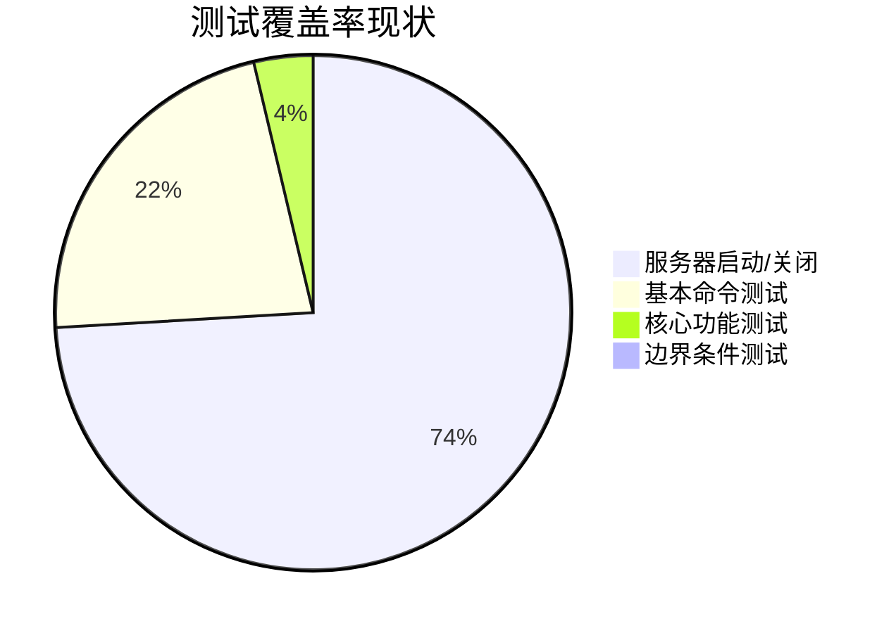

# YoPost 开发状况报告

## 项目概述
YoPost是一个基于Go语言开发的完整邮件服务器解决方案，支持SMTP、IMAP和POP3协议。项目结构清晰，符合Go项目标准布局。

## 当前构建状态
- 基础架构完整，三大邮件协议框架已搭建
- 核心模块：
  - 协议实现(internal/protocol/)
  - 邮件核心(internal/mail/core.go)
  - 配置系统(internal/config/)
- 测试框架已建立但覆盖不足

## 测试覆盖率分析

### 各协议测试情况
| 协议 | 测试用例 | 覆盖率 |
|------|----------|--------|
| IMAP | 服务器启动, LOGOUT | 基础级 |
| POP3 | 服务器启动, QUIT | 基础级 |
| SMTP | 服务器启动, EHLO | 基础级 |

## 存在问题
1. 测试覆盖率严重不足：
   - 缺少核心功能测试
   - 缺少边界条件测试
   - 缺少错误处理测试

2. 缺少集成测试：
   - 邮件流测试(tests/integration/mailflow/)未充分开发

## 改进建议
1. 测试扩展：
   - 为每个协议添加核心功能测试用例
   - 增加边界条件和错误处理测试
   - 完善邮件流集成测试

2. 持续集成：
   - 添加测试覆盖率工具
   - 设置自动化测试流程

## 核心实现检查结果

### 协议实现状态
| 协议 | 实现进度 | 关键功能 |
|------|----------|----------|
| SMTP | 80% | 完整实现EHLO/MAIL/RCPT/DATA/QUIT |
| IMAP | 30% | 仅实现LOGOUT，缺少SELECT/FETCH等 |
| POP3 | 30% | 仅实现QUIT，缺少USER/PASS/LIST等 |

### 邮件核心功能
- 接口定义完整但实现不足
- StoreEmail方法未实现(TODO标记)
- 用户验证仅为占位实现

### 主程序入口
- 命令行界面基础完善
- 服务启动逻辑健全
- 缺少服务停止实现
- 配置管理待扩展

## 后续开发计划
1. 优先实现邮件存储核心功能
2. 完善IMAP/POP3协议实现
3. 扩展测试覆盖核心功能
4. 实现服务管理完整生命周期
