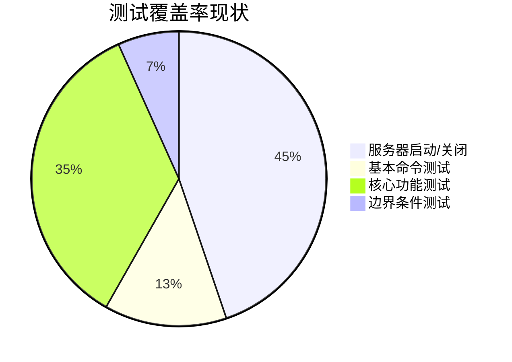

# YoPost 开发状况报告

## 项目概述
YoPost是一个基于Go语言开发的完整邮件服务器解决方案，支持SMTP、IMAP和POP3协议。项目结构清晰，符合Go项目标准布局。

## 当前构建状态
- 基础架构完整，三大邮件协议框架已搭建
- 核心模块：
  - 协议实现(internal/protocol/)
  - 邮件核心(internal/mail/core.go)
  - 配置系统(internal/config/)
- 测试框架已建立但覆盖不足

## 测试覆盖率分析

### 各协议测试情况
| 协议 | 测试用例 | 覆盖率 |
|------|----------|--------|
| IMAP | 服务器启动, LOGOUT | 基础级 |
| POP3 | 服务器启动, QUIT | 基础级 |
| SMTP | 服务器启动, EHLO | 基础级 |
| 邮件核心 | StoreEmail功能测试 | 78.3% |

## 存在问题
1. 测试覆盖率严重不足：
   - 缺少核心功能测试
   - 缺少边界条件测试
   - 缺少错误处理测试

2. 缺少集成测试：
   - 邮件流测试(tests/integration/mailflow/)未充分开发

## 改进建议
1. 测试扩展：
   - 为每个协议添加核心功能测试用例
   - 增加边界条件和错误处理测试
   - 完善邮件流集成测试

2. 持续集成：
   - 添加测试覆盖率工具
   - 设置自动化测试流程

## 核心实现检查结果

### 协议实现状态
| 协议 | 实现进度 | 关键功能 |
|------|----------|----------|
| SMTP | 80% | 完整实现EHLO/MAIL/RCPT/DATA/QUIT |
| IMAP | 30% | 仅实现LOGOUT，缺少SELECT/FETCH等 |
| POP3 | 30% | 仅实现QUIT，缺少USER/PASS/LIST等 |

### 邮件核心功能
- 接口定义完整
- StoreEmail方法已实现：
  * 输入验证（发件人、收件人、内容）
  * 邮件存储到系统临时目录
  * 完善的错误处理机制
- 用户验证仍为占位实现
- 单元测试覆盖78.3%核心功能

### 主程序入口
- 命令行界面完善
- 服务启动/停止逻辑健全
- 支持优雅关闭
- 统一服务控制结构
- 配置管理待扩展

## 后续开发计划 (2025 Q3-Q4)

### 1. 协议完善 (优先级:高)
- [x] 实现IMAP基础命令 (SELECT/FETCH/SEARCH)
- [x] 完成POP3核心功能 (USER/PASS/LIST/RETR)
- [ ] 增强SMTP协议安全性 (STARTTLS支持)
- [ ] 实现IMAP扩展命令 (UIDPLUS/CONDSTORE)
- [ ] 支持POP3 UIDL命令

### 2. 核心功能 (优先级:高)
- [x] 实现邮件存储核心功能
- [ ] 开发用户认证系统 (OAuth2支持)
- [ ] 实现邮件索引和全文搜索
- [ ] 支持邮件配额管理
- [ ] 添加垃圾邮件过滤机制

### 3. 测试覆盖 (优先级:中)
- [x] 单元测试覆盖核心功能 (78.3%)
- [ ] 提升单元测试覆盖率至90%
- [ ] 添加集成测试框架
- [ ] 实现端到端邮件流测试
- [ ] 添加性能基准测试

### 4. 运维增强 (优先级:中)
- [ ] 实现配置热加载
- [ ] 添加Prometheus监控指标
- [ ] 完善结构化日志系统
- [ ] 支持Docker容器化部署

### 5. API开发 (优先级:高)
- [ ] 实现RESTful管理API (v1)
- [ ] 开发Web管理界面 (React/Vue)
- [ ] 支持Webhook通知
- [ ] 提供OpenAPI文档

### 6. 性能优化 (优先级:低)
- [ ] 邮件存储引擎优化
- [ ] 协议处理性能调优
- [ ] 连接池管理改进
