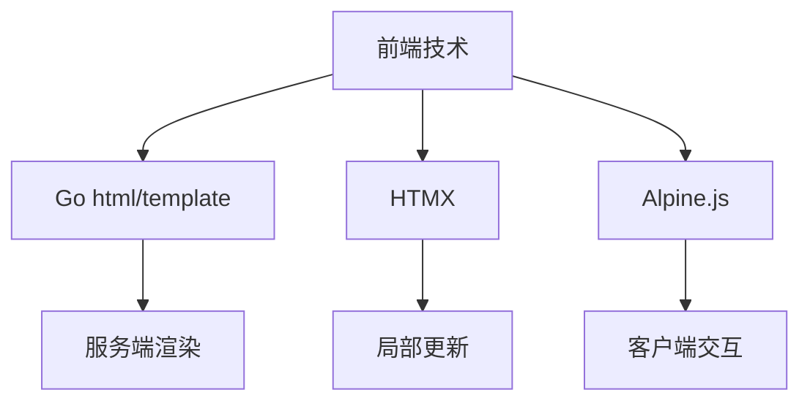

# YoPost Web界面开发指南

## 1. 技术架构

## 2. 开发规范

### 2.1 模板开发
- 使用`base.html`作为基础模板
- 通过`{{define}}`定义可替换块
- 命名约定：
  - 管理模板: `admin/*.html`
  - 邮件模板: `mail/*.html`

### 2.2 静态资源
- 存放位置: `internal/web/static`
- 子目录:
  - `css/`: 样式文件
  - `js/`: 脚本文件
- 引用方式: `/static/[type]/[file]`

### 2.3 交互实现
- 简单交互: 直接使用HTMX
- 复杂状态: 使用Alpine.js
- 避免直接使用JavaScript

## 3. 工作流程

### 3.1 添加新页面
1. 创建模板文件
2. 在handler中添加路由
3. 实现数据获取逻辑
4. 更新导航菜单

### 3.2 修改现有页面
1. 定位模板文件
2. 修改模板内容
3. 更新handler数据准备

## 4. 最佳实践
- 保持模板简洁
- 使用HTMX属性实现动态效果
- 模板中避免复杂逻辑
- 所有交互元素添加ARIA标签
